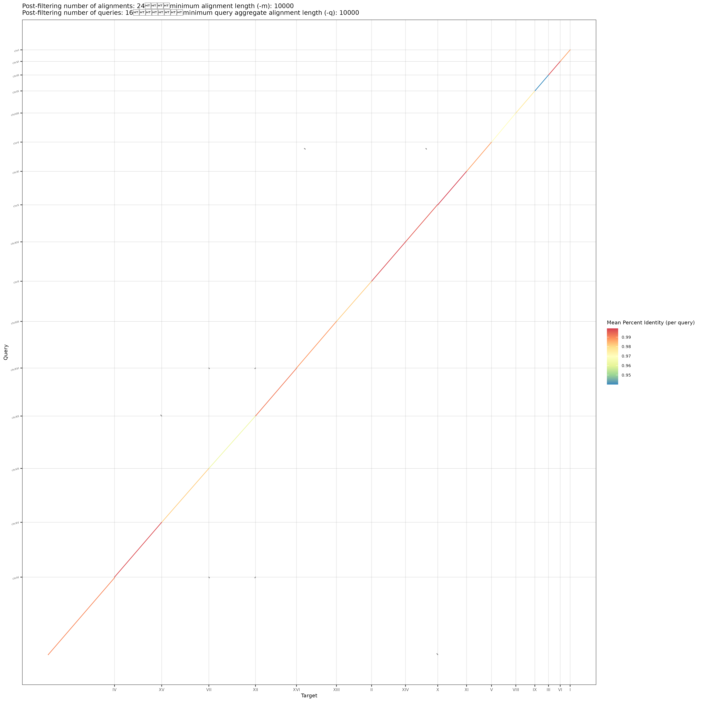

# 酵母基因组组装 + 评估 + 注释全流程教程

> 📖 **English version**: This tutorial also has an English README ([README.md](README.md)). Please refer to it for English reading.

## Yeast Genome Assembly, Evaluation & Annotation Pipeline

一个完整的酵母（*Saccharomyces cerevisiae* S288C）基因组组装教学项目，覆盖从 K-mer 分析到带注释的染色体级基因组的端到端工作流。

---

## 📖 项目简介 / Overview

本教程以酿酒酵母（S288C）为模式物种，实战演示 **13 种组装器** 对比、组装质量评估、抛光、Hi-C 挂载、参考引导重排、参考转移注释等完整流程。所有脚本和产物均可在 Linux/macOS 上复现。

**适用对象**：

- 生物信息学初学者（学习基因组组装完整流程）
- 生信从业者（参考实现 / 模板项目）
- 研究酵母或近缘物种的研究人员

---

## 🎯 教程核心特色

1. **13 种组装器实战对比** — Illumina、CLR、HiFi、ONT 全覆盖
2. **三件套评估体系** — QUAST（连续性/准确性）+ BUSCO（完整性）+ dotPlotly（共线性）
3. **Hi-C 挂载 + 参考引导重排** — 完整展示 16 条染色体构建
4. **注释完整闭环** — Liftoff 核注释 + 线粒体注释（含密码子表坑）
5. **实测数据驱动** — 每个步骤都有真实运行结果，非空泛预期

---

## 📂 项目结构

```
git_repo/
├── 01.kmer_analysis/             # K-mer 分析（基因组大小预估）
├── 02.soapdenovo2_assembly/      # SOAPdenovo2（短读组装）
├── 03.spades_assembly/           # SPAdes（多数据组装）
├── 04.canu_assembly/             # Canu + purge_dups（HiFi 校正）
├── 05.wtdbg2_assembly/           # wtdbg2（CLR 快速组装）
├── 06.nextdenovo_assembly/       # ★ nextDenovo ONT（主组装）
├── 07.flye_assembly/             # Flye（ONT/HiFi）
├── 08.mecat2_assembly/           # MECAT2（CLR）
├── 09.necat_assembly/            # NECAT（ONT）
├── 10.hifiasm_assembly/          # hifiasm（HiFi）
├── 11.quickmerge_assembly/       # quickmerge（混合拼接）
├── 12.dotplotly_analysis/        # 共线性可视化（13 组装 vs 参考）
├── 13.quast_analysis/            # QUAST 评估
├── 14.busco_analysis/            # BUSCO 评估
├── 15.nextpolish/                # ★ NextPolish 抛光
├── 16.hic_scaffolding/           # ★ Hi-C 挂载（YaHS）
├── 17.ref_chromosomes/           # ★ 参考引导重排（16 染色体 + mtDNA）
├── 18.annotation/                # ★ 注释（核 + 线粒体）
│   └── final_assembly/           # ★ 最终交付（genome.fa + annotations.gff3 + proteins.fa）
├── rawData/                      # 原始测序数据（参考基因组 + WGS/PacBio/ONT/HiC）
└── Genome_assembly_tutorial.pdf  # 完整教程 PDF（58 MB）
```

**带 ★ 的章节是教程的核心推荐流程**（nextDenovo ONT → NextPolish → Hi-C → 参考引导 → 注释）。

## 🖼 最终交付：参考引导重排后的染色体



*16 条核染色体 + 1 条线粒体（每条 contig 对应参考上的单一区域，无跨染色体重排）*

---

## 🚀 快速开始 / Quick Start

### 环境要求

- **操作系统**：Linux（推荐 Ubuntu 20.04+）或 macOS
- **Conda**：miniforge3 / miniconda / anaconda 任一
- **磁盘空间**：原始数据 ~150 GB（教程自身产物已精简）
- **内存**：建议 ≥64 GB（小基因组 ≤32 GB 够用）

### 必需 conda 环境

| 环境 | 用途 | 关键工具 |
| --- | --- | --- |
| `genome_assembly` | 主流程 | minimap2、samtools、liftoff、yahs、bwa、quast、bandage |
| `busco` | BUSCO 评估 | busco、hmmsearch、prodigal |
| `RNA-seq` | 注释辅助 | gffread |
| `old_base` | 通用 | aria2c、Rscript、juicer_tools |

### 关键变量

脚本中的路径全部使用 **可移植的环境变量**，无需硬编码：

```bash
REPO_ROOT=${REPO_ROOT:-$(pwd)}        # 教程项目根目录
CONDA_PREFIX=${CONDA_PREFIX:-}        # genome_assembly 环境
BUSCO_BIN=${BUSCO_BIN:-}              # busco 环境 bin
BUSCO_ENV=${BUSCO_ENV:-}              # busco 环境根
RNA_SEQ_BIN=${RNA_SEQ_BIN:-}          # RNA-seq 环境 bin
RNA_SEQ_ENV=${RNA_SEQ_ENV:-}          # RNA-seq 环境根
DATA_ROOT=${DATA_ROOT:-}              # 数据存放根（Download 工具等）
MINIFORGE3=${MINIFORGE3:-}            # miniforge 安装根
HOME=${HOME}                          # 用户 home
```

实际使用时请**激活对应 conda 环境**或**显式 export 这些变量**。

---

## 📚 教程章节对应

| 章节 | 标题 | 章节 | 标题 |
| --- | --- | --- | --- |
| 1 | 基因组调研 | 5 | 组装质量评估 |
| 2 | K-mer 分析 | 6 | 分析实例（13 组装实战）|
| 3 | 数据类型简介 | 7 | 基因组注释 |
| 4 | 组装算法简介 | 8 | 教程总结 |

每个章节对应 `01-18.*` 一个目录。教程 PDF（`Genome_assembly_tutorial.pdf`）包含完整的命令、参数说明、踩坑记录。

---

## 🎓 关键产出

完成本教程后，可得到如下交付物：

```
18.annotation/final_assembly/
├── genome.fa          # 完整基因组（17 条：chrI-XVI + Mito，12 MB）
├── annotations.gff3   # 完整注释（6,610 基因：核 6,582 + 线粒体 28）
└── proteins.fa        # 蛋白序列（6,577 条，线粒体用密码子表 3 翻译）
```

**质量指标**（本实例实测）：

| 指标 | 值 | 评估工具 |
| --- | --- | --- |
| 基因组大小 | 12.04 Mb（核 12.04 + 线粒体 0.1）| QUAST |
| N50 | 928 Kb | QUAST |
| misassemblies | 26 | QUAST |
| BUSCO C:99.9% / M:1 | 完整 | BUSCO |
| 基因数 | 6,610（与官方 S288C R64 一致）| Liftoff |

---

## ⚠️ 注意事项

1. **路径伪化**：本仓库脚本中的所有路径已替换为环境变量（`${REPO_ROOT}`、`${CONDA_PREFIX}` 等），首次使用前请根据实际环境调整
2. **下载数据**：`rawData/` 目录下的测序数据**仅保留少量样本**，完整数据需要从原始数据库（ENA/SRA）下载
3. **大文件精简**：教程自身的中间产物已 `touch` 占位为 0 字节，保留关键交付物与可视化
4. **中间产物可删**：`logs/`、`01.work/`、`*.bam`、`*.mmi` 等中间文件可定期清理

---

## 📦 数据来源

| 数据 | 来源 | 用途 |
| --- | --- | --- |
| 参考基因组 | Ensembl R64-1-1 | 比对参考、注释转移 |
| PacBio HiFi | SRR13577847 | HiFi 组装（hifiasm/Canu）|
| PacBio CLR | PRJEB7245 (ERR1655118-125) | CLR 组装（MECAT2/wtdbg2）|
| ONT | PRJEB19900 | ONT 组装（nextDenovo/Flye/NECAT）|
| Illumina WGS | ERR1938683 | SPAdes 短读组装 |
| Hi-C | SRR28065402 | Hi-C 挂载（YaHS）|
| 基因注释 GFF3 | Ensembl R64-1-1.63 | Liftoff 参考 |

详细下载链接见教程 PDF 的 6.2 节。

---

## 🔧 工具版本

教程使用的工具版本（其他版本可能也兼容）：

| 工具 | 版本 | conda 环境 |
| --- | --- | --- |
| BUSCO | 6.1.0 | busco |
| Liftoff | 1.1.3 | genome_assembly |
| NextPolish | 1.4.1 | - |
| minimap2 | 2.31 | genome_assembly |
| samtools | 1.19 | genome_assembly |
| bwa | 0.7.17 | - |
| yahs | 1.2.2 | - |
| quast | 5.2.0 | genome_assembly |
| R | 4.5.1 | old_base |
| gffread | 0.12.7 | RNA-seq |

---

## 📜 许可证

本教程仅供学习交流使用。引用其中工具请参考各自原始论文。

## 🙏 致谢

感谢所有上游工具的开发者（minimap2、samtools、bwa、yahs、busco、quast、liftoff、nextDenovo、nextPolish、spades、canu、flye、mecat2、necat、hifiasm、quickmerge、wtdbg2、soapdenovo2、juicer_tools 等）。